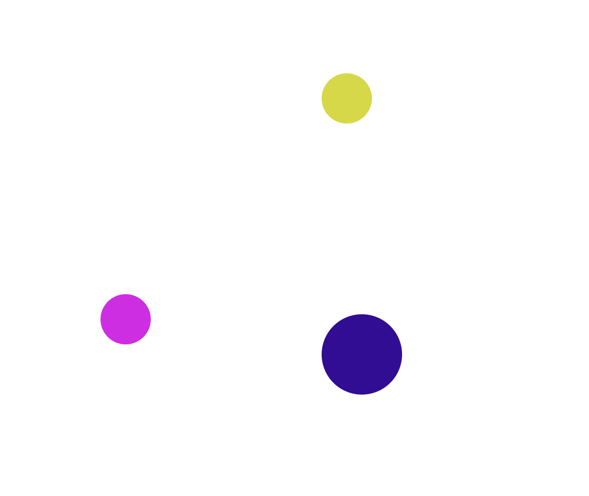

# BallMovement

 Ball Movement was created as a continual learning project in one dimensional motion.

## Description:

 Ball Movement is a one dimensional motion learning project created by using JavaScript. 
  

  Have fun using this exercise by changing the variables and elements in the HTML file to move the ball across the X and Y axis.

## Installation:

 Upload the HTML file to your browser and or code editor to edit the vaules and elements within the script. 
   

## Usage:

 Learning tool in one dimenonal movement. 

## Roadmap:

*This exercise will continually be built and improved on as I learn additional skills in Javascript.*

***

**Future updates:**
- Update code to reflect the airbnb javascript style guide.
- create ball movements using Switch().
- Set window width edge detection.

## Support:

 Want to share feedback or comments?

 
  
  Reach me on *[Linkedin](https://www.linkedin.com/in/derek-diaz/)* or *[Twitter](https://twitter.com/home).*
  

